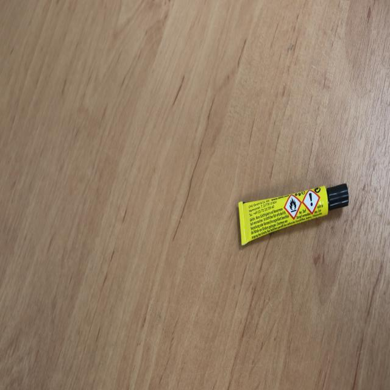
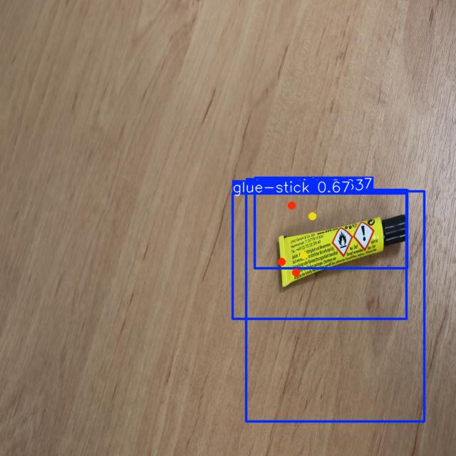

# Learning

To learn posing I followed this [Blog post](https://blog.roboflow.com/train-a-custom-yolov8-pose-estimation-model/).
But since I'm used to develop in Python using scripts, I adapted it.

I adapted 3 scripts from the blog's notebook:

1. [download_glue_stick_model.py](./download_glue_stick_model.py) for downloading the model
2. [train_model.py](./train_model.py) for downloading the model
3. [run_model.p](./run_model.py) for running the model

I execute each script on the presented order.

## Challenges and Learnings

### Creating a dataset is hard

Create proper train and valid images. I followed the glue stick example. I took 4 iterations to learn that the model needs at least one image as test, train and valid to be able use train script.

### Training required changing data.yaml

Training of model failed with downloaded model. This is an example of the exception:

```bash
RuntimeError: Dataset '/home/renzo/PycharmProjects/crossfit-judge/learning/glue-stick-runs-dataset-4/data.yaml' error ❌ 
Dataset '/home/renzo/PycharmProjects/crossfit-judge/learning/glue-stick-runs-dataset-4/data.yaml' images not found ⚠️, missing path '/home/renzo/PycharmProjects/crossfit-judge/learning/glue-stick-runs-dataset-4/glue-stick-runs-dataset-4/valid/images'
Note dataset download directory is '/home/renzo/PycharmProjects/datasets'. You can update this in '/home/renzo/.config/Ultralytics/settings.json'
```

It only worke by manually editing data.yml. 
[Iteration 4](./glue-stick-dataset-4/data.yaml) is an edited example.
Check it has no mention to its parent folder (glue-stick-dataset-4).
[Iteration 3](./glue-stick-dataset-3/data.yaml) is an example of original downloaded file, having reference to its parent dir and causing the mentioned exception.


I was able to run the trained model present on [glue-stick-runs](./glue-stick-runs). But got no object detection:

.  

As a second try I trained the model present on [Glue-Stick-Project-5](./Glue-Stick-Project-5). 
This one detected the object, but 3 times:

.  

